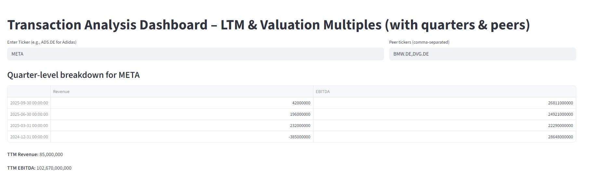
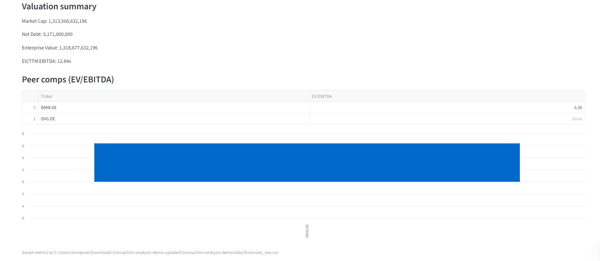
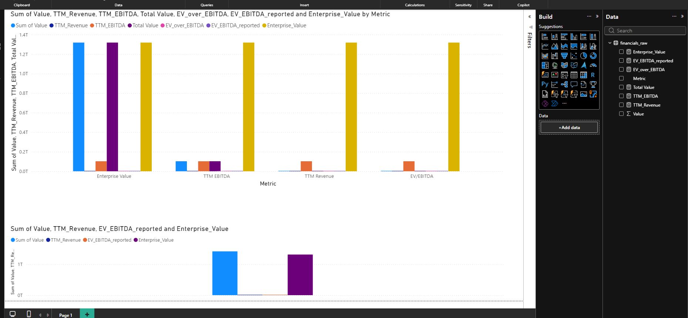

# Transaction Analysis – LTM Revenue, EBITDA & EV/EBITDA

This project demonstrates a simple, transaction-style financial analysis for M&A, Due Diligence and Corporate Valuation contexts.
It pulls real public-company financial data, calculates key metrics such as:

- LTM (Last Twelve Months) Revenue
- LTM EBITDA
- Enterprise Value (EV)
- EV/EBITDA multiple
- EV/Sales multiple

These KPIs are essential in Transaction Services to benchmark valuation, identify anomalies and support deal decisions.

---

## Files in this repo

- `notebooks/01_ltmebitda_valuation.ipynb`  -Jupyter notebook with extraction & LTM calculations (single code cell).
- `app/streamlit_app.py`                   - Streamlit app to display key LTM figures & multiples interactively.
- `data/financials_raw.csv`                - example export (empty placeholder).
- `requirements.txt`                       - Python packages required to run the demo.
- `Test.pbix`                              - Power BI Run
- `README.md`                              -this file.

---

## Quickstart (local)

1. Create a new virtual environment (recommended):
   ```bash
   python -m venv .venv
   source .venv/bin/activate   # Linux / macOS
   .venv\Scripts\activate    # Windows PowerShell
   ```

2. Install requirements:
   ```bash
   pip install -r requirements.txt
   ```

3. Run the Streamlit dashboard:
   ```bash
   streamlit run app/streamlit_app.py
   ```

4. Open `notebooks/01_ltmebitda_valuation.ipynb` in Jupyter (optional).

---

## Notes & caution

- This project uses `yfinance` to fetch public-company data. The library depends on Yahoo Finance endpoints which may occasionally be rate-limited or change formatting.
- For a production-grade transaction analysis, you would replace `yfinance` with licensed financial data (e.g., Bloomberg, Refinitiv, Capital IQ) and add more robust error handling & reconciliation of financial statement line items.
- See the code comments in the notebook and Streamlit app for guidance on mapping line items to LTM calculations.

---

## How this helps in Due Diligence / Transactions

This mini-project automates the first analytical steps in a transaction:
- Extract financials quickly,
- Compute LTM KPIs used by valuation teams,
- Present a compact dashboard for decision-makers,
- Provide a reproducible workflow that can be extended to peer comps and deeper validation.

<p align="center">
  
</p>

<p align="center">
  
</p>

<p align="center">
  
</p>


Author: Shine Jose — M.Sc. Informatik (Data Science)
